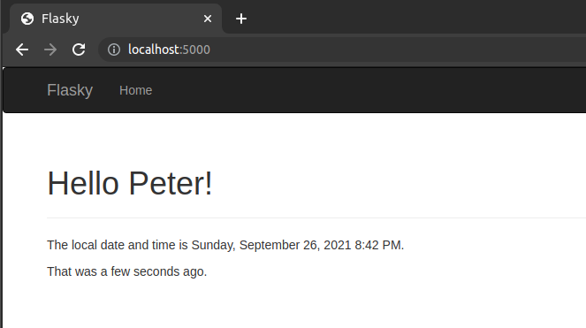
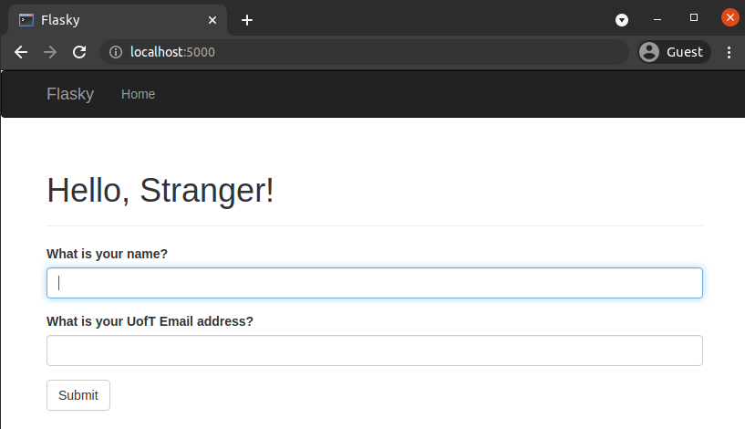
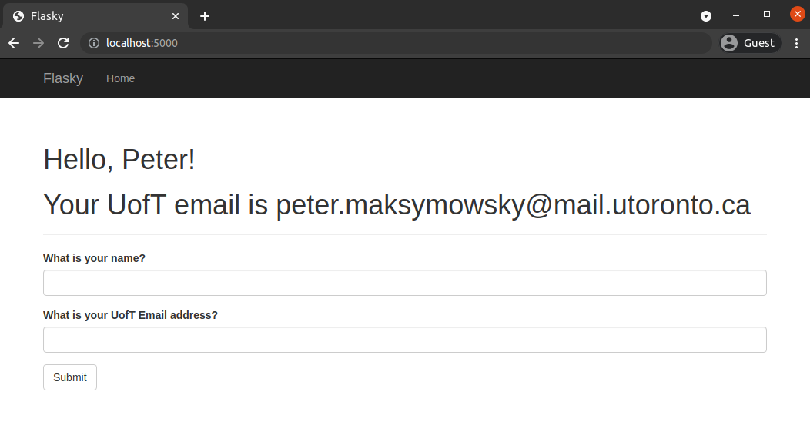
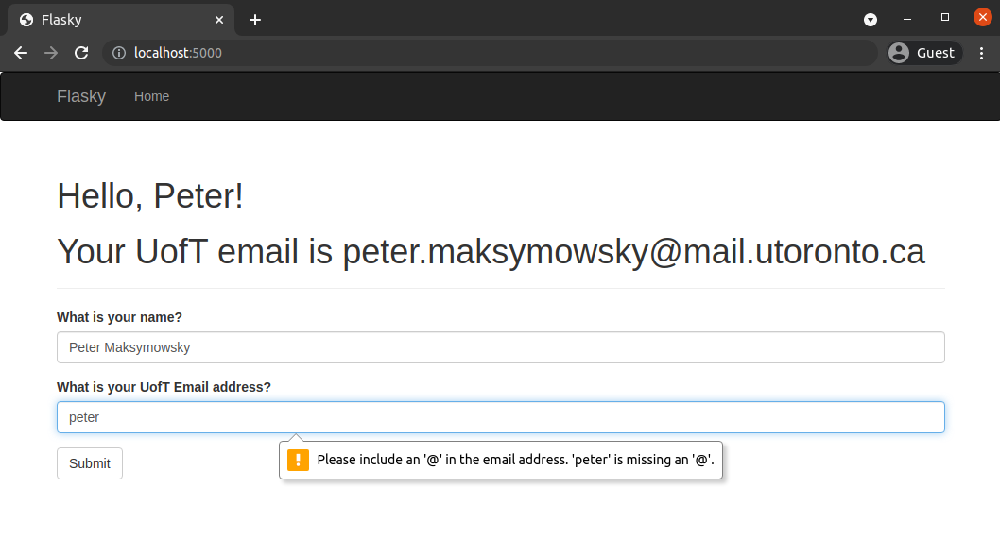
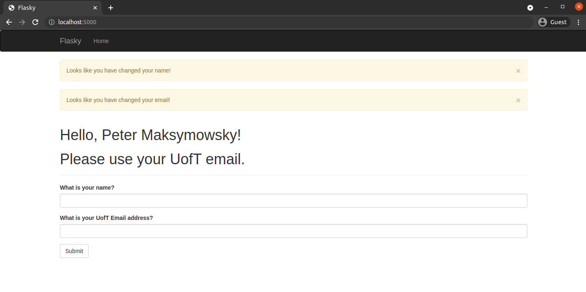

# Peter Maksymowsky - ECE444 Lab 2
*note: this repo is a clone of [Flasky](https://github.com/miguelgrinberg/flasky)

# Activity 1:

# Activity 2:

# Activity 3:

# Activity 4:

## Activity 4.2:

## Activity 4.3:

## Activity 4.4:

## Activity 4.5:
